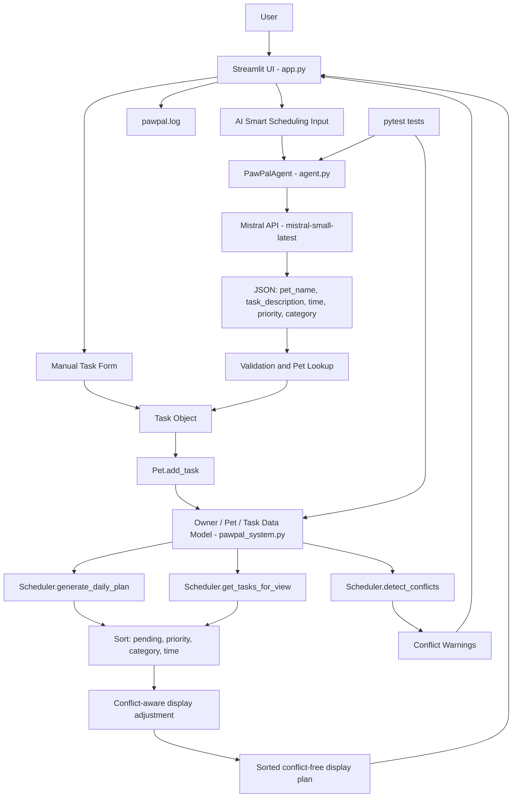

# PawPal+ System Architecture

```mermaid
flowchart TD
    A[User] --> B[Streamlit UI - app.py]

    B --> C[Manual Task Form]
    B --> D[AI Smart Scheduling Input]

    C --> E[Task Object]
    D --> F[PawPalAgent - agent.py]
    F --> G[Mistral API - mistral-small-latest]
    G --> H[JSON: pet_name, task_description, time, priority, category]

    H --> I[Validation and Pet Lookup]
    I --> E

    E --> J[Pet.add_task]
    J --> K[Owner / Pet / Task Data Model - pawpal_system.py]

    K --> L[Scheduler.generate_daily_plan]
    K --> R[Scheduler.get_tasks_for_view]
    K --> M[Scheduler.detect_conflicts]

    L --> S[Sort: pending, priority, category, time]
    R --> S
    S --> T[Conflict-aware display adjustment]
    T --> N[Sorted conflict-free display plan]
    M --> O[Conflict Warnings]

    N --> B
    O --> B

    B --> P[pawpal.log]
    Q[pytest tests] --> K
    Q --> F
```
